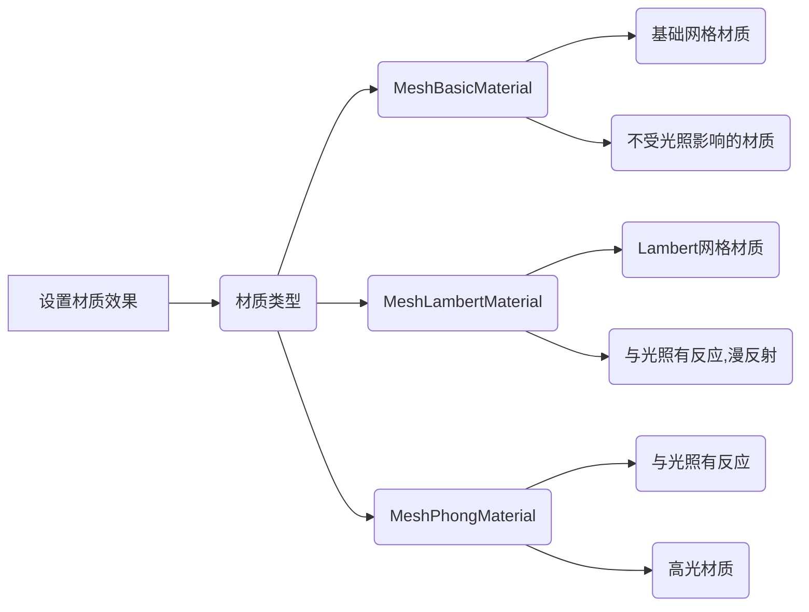

## three.js-master 目录结构

```
three.js-master
└───build——src目录下各个代码模块打包后的结果
    │───three.js——开发的时候.html文件中要引入的threejs引擎库，和引入jquery一样，可以辅助浏览器调试
    │───three.min.js——three.js压缩后的结构文件体积更小，可以部署项目的时候在.html中引入。
    │
└───docs——Three.js API文档文件
    │───index.html——打开该文件可以实现离线查看threejs API文档
    │
└───editor——Three.js的可视化编辑器，可以编辑3D场景
    │───index.html——打开应用程序
    │
└───docs——Three.js API文档文件
    │───index.html——打开该文件可以实现离线查看threejs API文档
    │
└───examples——里面有大量的threejs案例，平时可以通过代码编辑全局查找某个API、方法或属性来定位到一个案例
    │
└───src——Three.js引擎的各个模块，可以通过阅读源码深度理解threejs引擎
    │───index.html——打开该文件可以实现离线查看threejs API文档
    │
└───utils——一些辅助工具
    │───\utils\exporters\blender——blender导出threejs文件的插件
```


这就好比拍照，站在一个场景中，用相机拍照，咔嚓一下就是渲染操作，指定场景、相机作为参数。

## 场景

### 网格模型 Mesh

#### 几何体对象 Geometry

#### 材质对象 Material

### 光照 Light

#### 平行光、环境光、点光源

## 相机 Camera

```js
// 设置相机指向(指向的场景对象)
camera.lookAt(scene.position);
```

## 渲染器 Renderer

```js
// 设置背景颜色
renderer.setClearColor(0xb9d3ff, 1);
```

渲染器 render 方法


three 动画程序一般选择 requestAnimationFrame 方法，而不是 setInterval()方法设置固定的刷新频率，也就是周期性执行时间。





going on
